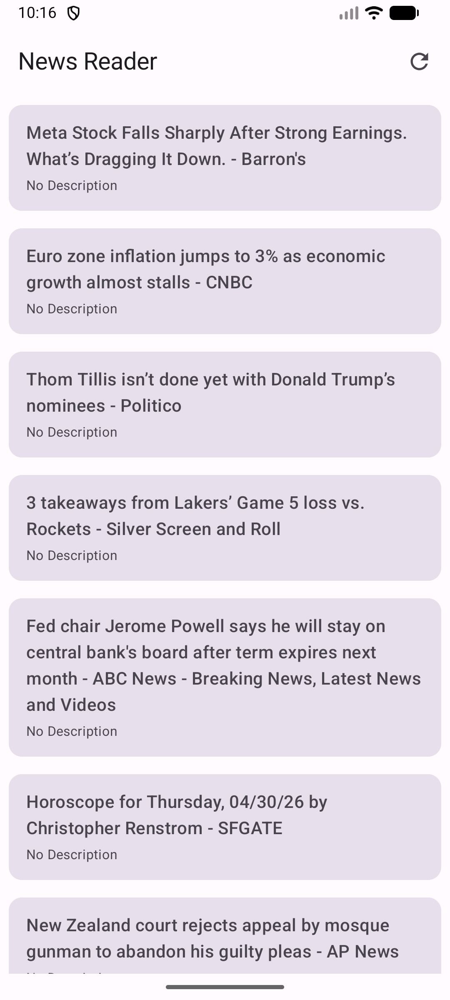

# Tugas 6 - News Reader App (KMP)

Aplikasi pembaca berita sederhana yang dibangun menggunakan Kotlin Multiplatform (Android, iOS, Desktop).

## Tampilan Aplikasi

## Demo Video
Tonton demo aplikasi di YouTube: [https://youtu.be/gQC1Mko3lsc](https://youtu.be/gQC1Mko3lsc)

## Fitur
- **Fetch API**: Mengambil berita terkini dari NewsAPI secara dinamis.
- **Daftar Berita**: Menampilkan list artikel dengan gambar, judul, dan deskripsi, diurutkan dari yang terbaru.
- **Detail Berita**: Menampilkan detail artikel saat item diklik.
- **Refresh**: Fitur untuk memperbarui daftar berita dengan mekanisme *Cache Busting* (selalu mengambil data terbaru).
- **State Management**: Menangani kondisi Loading, Success, dan Error dengan rapi.

## API yang Digunakan
- **NewsAPI.org**
- **Endpoint**: `https://newsapi.org/v2/everything` (dioptimalkan dengan query `general` dan `sortBy=publishedAt`)
- **Library**: 
  - Ktor (Network)
  - Kamel (Image Loading)
  - Kotlinx Serialization (JSON Parsing)

## Struktur Proyek
- `org.example.project.data`: Berisi model data, API service (NewsApi), dan Repository.
- `org.example.project.ui`: Berisi ViewModel untuk logika UI dan penanganan State.
- `App.kt`: Entry point untuk tampilan utama, navigasi, dan integrasi komponen UI.

---
*Catatan: Proyek ini telah dipindahkan ke Drive D untuk optimasi ruang penyimpanan Gradle.*
